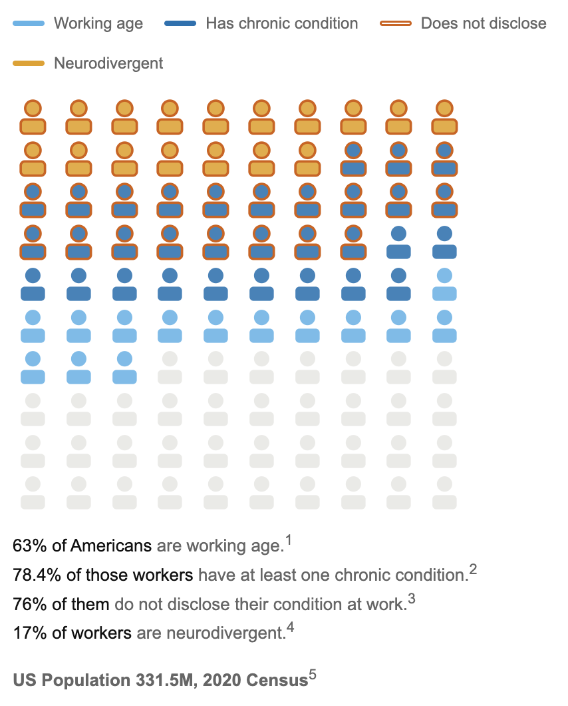

# The Allied Workplace Visualization
[The Allied Workplace Home](https://www.thealliedworkplace.com/research)

Data visualization for the **Creative Transformations for Change (CT4C)** project **The Allied Workplace** — a self-contained HTML chart built to communicate workforce disability and neurodiversity statistics in an accessible, visual format. The isotype was chosen to clearly represent percentages of very large populations: US population and people of working age, then within that various sub-populations. Citations on embedded locations.

[See it embedded](https://www.thealliedworkplace.com/research)

## What's here

| File | Description |
|---|---|
| `isotype_animated_v5.html` | Animated isotype chart showing the scale of chronic conditions, non-disclosure, and neurodivergence within the U.S. working-age population |
| `index.html` | Local preview page that renders the visualization with citations |

## Tools used

- Vanilla HTML, CSS, and JavaScript — no build step, no dependencies
- Inline SVG for the isotype figures
- CSS transitions and JS sequencing for animation
- Designed to embed cleanly as an `<iframe>` with a transparent background

## Credits

Visualization built with [Claude Code](https://claude.ai/code) (Anthropic).
